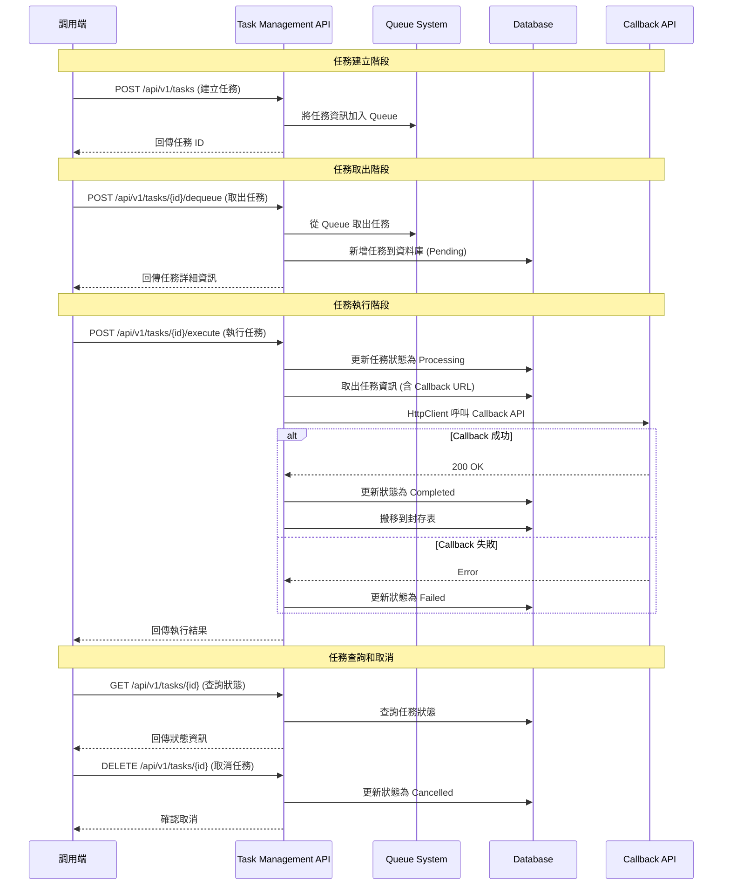
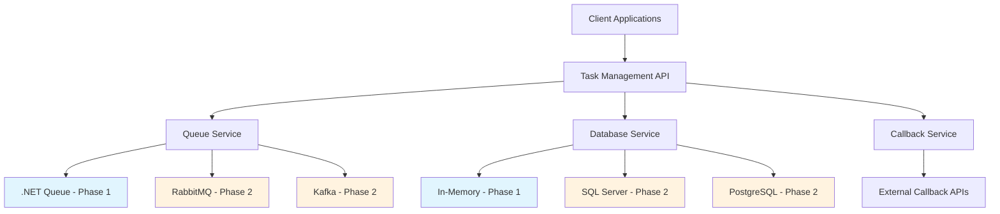

# PRD: Task Management Service V1

## Executive Summary

Task Management Service V1 是一個基於 Queue 和 Callback 架構的異步任務處理系統，專為開發團隊設計。服務使用 ASP.NET Core 9 Web API，支援任務的建立、取出、執行和狀態追蹤，採用漸進式架構演進策略，從內存實作開始逐步升級到企業級解決方案。

## Problem Statement

**解決的問題：**
- 開發團隊需要一個可靠的異步任務處理機制
- 缺乏統一的任務狀態追蹤和管理系統
- 需要支援 Callback 機制的分散式任務執行

**重要性：**
- 提升系統解耦和可擴展性
- 支援長時間運行的背景作業
- 為未來微服務架構奠定基礎

## Architecture Overview

### System Flow Diagram



## User Stories

### 主要使用者角色：開發團隊成員

**角色 1：後端開發者**
- 需要建立和管理異步任務
- 需要整合 Callback API 處理任務結果
- 需要監控任務執行狀態

**角色 2：系統整合者**
- 需要將任務管理服務整合到現有系統
- 需要處理任務失敗和重試邏輯

### 詳細使用者故事

**US-001: 任務建立**
```gherkin
作為一個 後端開發者
我想要 透過 API 建立新任務
為了 啟動異步處理流程

Given 我有任務的基本資訊和 Callback URL
When 我呼叫 POST /api/v1/tasks
Then 系統應該將任務加入 Queue 並回傳任務 ID
And 任務狀態為 Queued
```

**US-002: 任務取出**
```gherkin
作為一個 系統整合者
我想要 從 Queue 取出待處理任務
為了 開始任務處理流程

Given Queue 中存在待處理任務
When 我呼叫 POST /api/v1/tasks/{id}/dequeue
Then 系統應該從 Queue 移除任務
And 在資料庫建立任務記錄，狀態為 Pending
```

**US-003: 任務執行**
```gherkin
作為一個 後端開發者
我想要 執行特定任務
為了 觸發 Callback API 並完成處理

Given 資料庫中存在 Pending 狀態的任務
When 我呼叫 POST /api/v1/tasks/{id}/execute
Then 系統應該更新狀態為 Processing
And 呼叫任務中指定的 Callback API
And 根據 Callback 結果更新最終狀態
```

**US-004: 任務狀態查詢**
```gherkin
作為一個 開發者
我想要 查詢任務的當前狀態
為了 追蹤任務處理進度

Given 系統中存在特定任務
When 我呼叫 GET /api/v1/tasks/{id}
Then 系統應該回傳任務的詳細資訊和當前狀態
```

**US-005: 任務取消**
```gherkin
作為一個 開發者
我想要 取消尚未完成的任務
為了 停止不必要的處理

Given 任務狀態為 Queued 或 Pending
When 我呼叫 DELETE /api/v1/tasks/{id}
Then 系統應該更新任務狀態為 Cancelled
And 如果任務在 Queue 中則移除
```

## Requirements

### Functional Requirements

**FR-001: 任務生命週期管理**
- 支援任務狀態：Queued, Pending, Processing, Completed, Failed, Cancelled
- 實作完整的 CRUD 操作
- Completed 任務自動搬移到封存表

**FR-002: Queue 系統整合**
- Phase 1: 支援 .NET Queue
- Phase 2: 支援 RabbitMQ 和 Kafka
- 無任務過期限制
- 不需要 Dead Letter Queue

**FR-003: 資料持久化**
- Phase 1: Memory 儲存
- Phase 2: 支援 SQL Server 和 PostgreSQL
- 任務資料包含 Callback API 資訊
- 封存表設計用於歷史資料

**FR-004: Callback 機制**
- 支援同步和非同步 Callback
- HttpClient 實作 API 呼叫
- 失敗時更新任務狀態為 Failed

**FR-005: API 設計**
- RESTful API 架構
- API 版本控制 (/api/v1/)
- 無認證授權需求

### Non-Functional Requirements

**NFR-001: 效能需求**
- 支援同時處理 100 個任務
- API 回應時間 < 200ms (95th percentile)

**NFR-002: 可擴展性**
- 架構支援未來微服務拆分
- 支援水平擴展

**NFR-003: 可靠性**
- 系統可用性 > 99%
- 任務狀態一致性保證

**NFR-004: 維護性**
- 清晰的錯誤訊息和日誌
- 支援 BDD 測試驅動開發
- 程式碼覆蓋率 > 80%

## API Specification

### Core Endpoints

```http
# 建立任務
POST /api/v1/tasks
Content-Type: application/json

{
  "name": "string",
  "description": "string",
  "callbackUrl": "string",
  "payload": "object",
  "priority": "integer"
}

Response: 201 Created
{
  "taskId": "guid",
  "status": "Queued",
  "createdAt": "datetime"
}

# 取出任務
POST /api/v1/tasks/{id}/dequeue

Response: 200 OK
{
  "taskId": "guid",
  "name": "string",
  "status": "Pending",
  "callbackUrl": "string",
  "payload": "object"
}

# 執行任務
POST /api/v1/tasks/{id}/execute

Response: 200 OK
{
  "taskId": "guid",
  "status": "Processing|Completed|Failed",
  "executedAt": "datetime",
  "callbackResult": "object"
}

# 查詢任務
GET /api/v1/tasks/{id}

Response: 200 OK
{
  "taskId": "guid",
  "name": "string",
  "status": "string",
  "createdAt": "datetime",
  "updatedAt": "datetime",
  "callbackUrl": "string"
}

# 取消任務
DELETE /api/v1/tasks/{id}

Response: 204 No Content

# 查詢任務列表
GET /api/v1/tasks?status={status}&page={page}&size={size}

Response: 200 OK
{
  "tasks": [],
  "totalCount": "integer",
  "page": "integer",
  "pageSize": "integer"
}
```

## BDD Test Scenarios

### Feature: Task Creation
```gherkin
Feature: 任務建立
  作為開發者
  我想要建立新的任務
  為了啟動異步處理流程

  Scenario: 成功建立任務
    Given 我有有效的任務資訊
    When 我發送 POST 請求到 "/api/v1/tasks"
    Then 回應狀態碼應該是 201
    And 回應應該包含任務 ID
    And 任務應該被加入到 Queue

  Scenario: 建立任務時缺少必要欄位
    Given 我的任務資訊缺少 callbackUrl
    When 我發送 POST 請求到 "/api/v1/tasks"
    Then 回應狀態碼應該是 400
    And 錯誤訊息應該指出缺少的欄位
```

### Feature: Task Processing
```gherkin
Feature: 任務處理
  作為系統
  我需要處理任務的整個生命週期
  為了確保任務正確執行

  Scenario: 成功執行任務並呼叫 Callback
    Given 存在狀態為 "Pending" 的任務
    And Callback API 可以正常回應
    When 我執行任務
    Then 任務狀態應該更新為 "Completed"
    And Callback API 應該被呼叫一次
    And 任務應該被搬移到封存表

  Scenario: Callback API 呼叫失敗
    Given 存在狀態為 "Pending" 的任務
    And Callback API 回應錯誤
    When 我執行任務
    Then 任務狀態應該更新為 "Failed"
    And 錯誤資訊應該被記錄
```

## Success Criteria

### 主要成功指標

1. **功能完整性**
   - ✅ 所有 5 個核心 API 端點正常運作
   - ✅ 任務狀態流程正確執行
   - ✅ Callback 機制成功整合

2. **效能指標**
   - ✅ API 回應時間 < 200ms (95th percentile)
   - ✅ 支援同時處理 100 個任務
   - ✅ Queue 操作延遲 < 10ms

3. **品質指標**
   - ✅ 程式碼覆蓋率 > 80%
   - ✅ 所有 BDD 測試通過
   - ✅ 零重大安全漏洞

4. **可用性指標**
   - ✅ 系統正常運行時間 > 99%
   - ✅ 任務狀態一致性 100%

## Implementation Roadmap

### Phase 1: MVP Implementation (Week 1-2)
**目標：建立基本功能的 Memory 版本**

**Sprint 1.1: 基礎架構**
- [ ] 建立 ASP.NET Core 9 專案
- [ ] 設計 Domain Models
- [ ] 實作 In-Memory Queue
- [ ] 建立基本 API Controllers

**Sprint 1.2: 核心功能**
- [ ] 實作任務 CRUD 操作
- [ ] Memory 資料存儲實作
- [ ] 基本狀態管理
- [ ] BDD 測試框架建置

**Sprint 1.3: Callback 機制**
- [ ] HttpClient 整合
- [ ] Callback API 呼叫邏輯
- [ ] 錯誤處理機制
- [ ] 狀態更新流程

### Phase 2: Production Ready (Week 3-4)
**目標：企業級功能和擴展性**

**Sprint 2.1: 資料持久化**
- [ ] SQL Server 整合
- [ ] Entity Framework Core 實作
- [ ] 封存表機制
- [ ] 資料遷移腳本

**Sprint 2.2: Queue 系統升級**
- [ ] RabbitMQ 整合
- [ ] Kafka 支援
- [ ] 配置管理系統
- [ ] 效能優化

**Sprint 2.3: 監控和維運**
- [ ] 健康檢查端點
- [ ] Logging 和 Metrics
- [ ] Docker 容器化
- [ ] 部署文件

## Constraints & Assumptions

### 技術約束
- 使用 ASP.NET Core 9 框架
- 初期限制同時處理 100 個任務
- 無認證授權需求
- RESTful API 設計原則

### 業務約束
- 專為開發團隊內部使用
- 不需要複雜的用戶管理
- 初期不需要監控和警報功能

### 假設
- Callback API 端點穩定可用
- 網路連線品質良好
- 開發團隊熟悉 BDD 測試方法
- 未來會有更多整合需求

## Out of Scope

### V1 版本不包含功能
- 使用者認證和授權系統
- 任務優先級排程
- 複雜的重試機制
- Dead Letter Queue 處理
- 即時監控和警報
- 任務執行時間限制
- 批次任務處理
- 任務相依性管理
- 多租戶支援
- 圖形化管理介面

### 明確排除項目
- 前端 UI 開發
- 多數據中心部署
- 高可用性叢集設置
- 災難復原機制

## Dependencies

### 外部相依性
- **Callback API Services**: 任務執行依賴外部 API 回應
- **Queue Infrastructure**: RabbitMQ/Kafka 在 Phase 2 需要部署
- **Database Systems**: SQL Server/PostgreSQL 在 Phase 2 需要設置

### 內部相依性
- **開發團隊**: BDD 測試框架熟悉度
- **DevOps 團隊**: 容器化和部署支援
- **架構團隊**: 微服務架構規劃協調

### 技術相依性
- .NET 9 Runtime
- ASP.NET Core 9
- Entity Framework Core (Phase 2)
- HttpClient 和相關 HTTP 套件
- BDD 測試框架 (SpecFlow 或類似)

## Risk Assessment

### 高風險項目
1. **Callback API 可靠性**: 外部 API 失敗率可能影響系統穩定性
   - 緩解策略: 實作重試機制和失敗狀態記錄

2. **同時處理能力**: 100 個任務的併發處理限制
   - 緩解策略: 效能測試驗證，必要時調整架構

### 中風險項目
1. **Memory 到持久化轉換**: Phase 2 資料遷移複雜度
   - 緩解策略: 設計良好的抽象層，逐步遷移

2. **Queue 系統切換**: 從 .NET Queue 升級的相容性
   - 緩解策略: 介面抽象化，配置驅動切換

### 低風險項目
1. **API 版本管理**: 未來版本相容性
   - 緩解策略: 遵循 RESTful 最佳實踐

## Appendix

### 技術參考架構



### 資料模型設計

```csharp
// 任務主表
public class Task
{
    public Guid Id { get; set; }
    public string Name { get; set; }
    public string Description { get; set; }
    public TaskStatus Status { get; set; }
    public string CallbackUrl { get; set; }
    public object Payload { get; set; }
    public int Priority { get; set; }
    public DateTime CreatedAt { get; set; }
    public DateTime UpdatedAt { get; set; }
    public DateTime? ExecutedAt { get; set; }
    public object CallbackResult { get; set; }
}

// 任務封存表
public class ArchivedTask
{
    public Guid Id { get; set; }
    public string Name { get; set; }
    public TaskStatus FinalStatus { get; set; }
    public DateTime CompletedAt { get; set; }
    public DateTime ArchivedAt { get; set; }
    // 其他必要的封存欄位...
}

// 任務狀態枚舉
public enum TaskStatus
{
    Queued,
    Pending,
    Processing,
    Completed,
    Failed,
    Cancelled
}
```

---

**文件版本**: 1.0
**最後更新**: 2025-09-13T12:55:29Z
**下次審查**: 產品開發 Sprint 規劃時